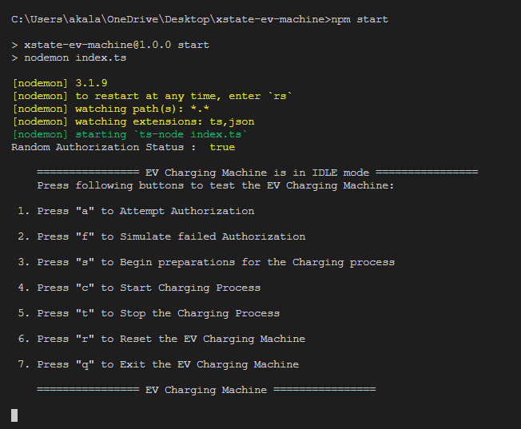
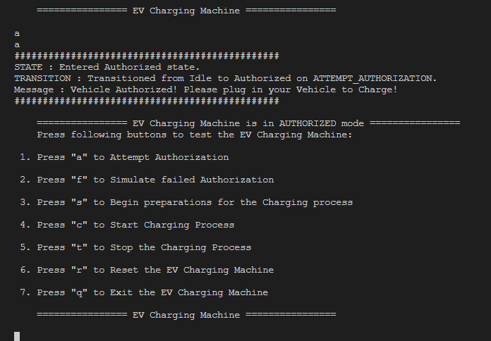
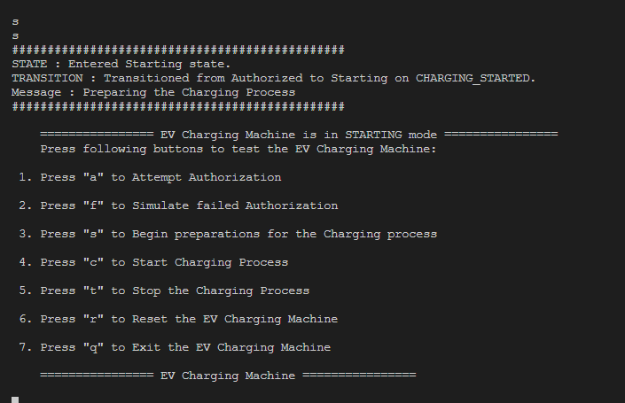
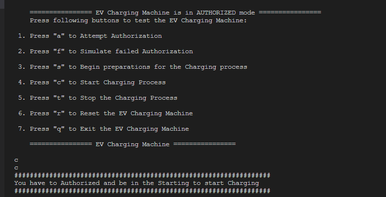
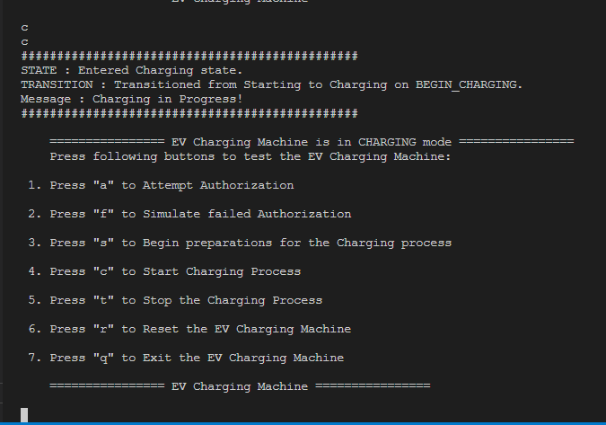
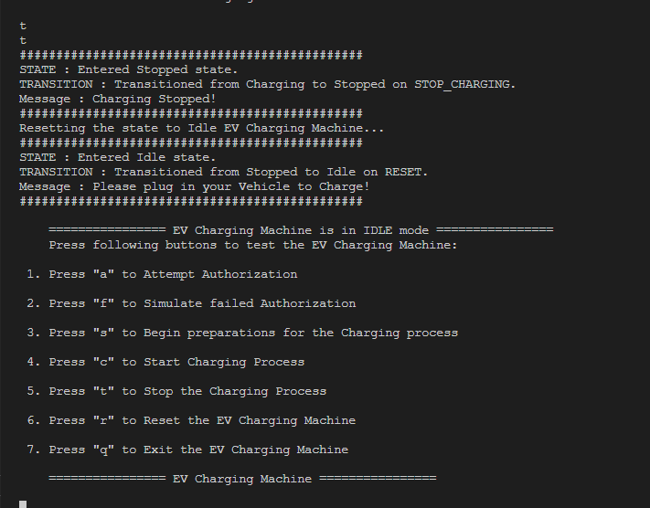
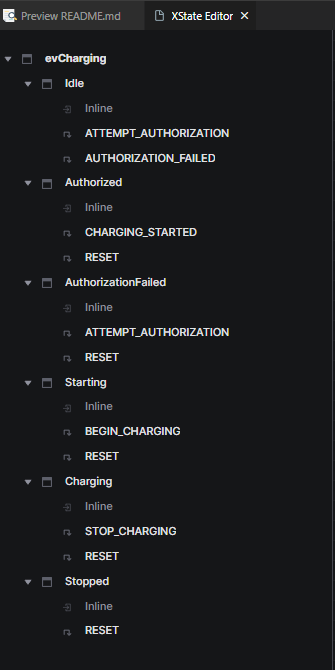
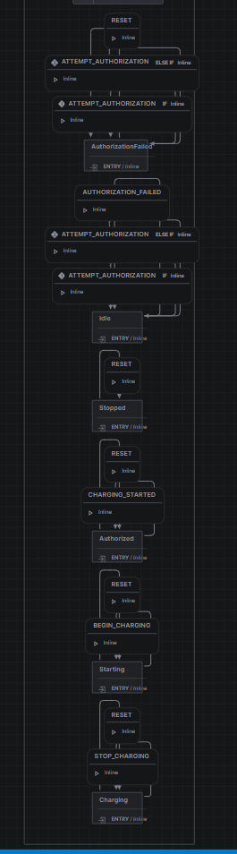

## XState based EV Charging Machine

GitHub Repo / Source Code - https://github.com/dewMyth/xstate-ev-charging-machine

### How to run the application

1. Clone the https://github.com/dewMyth/xstate-ev-charging-machine.git repository.
2. Once cloned, Open a terminal in the root directory
3. Then run the following to install the necessary NPM libraries. (`xstate`, `typescript`,`ts-node` and `nodemon`)

```bash
npm install
```

4. Then run the following comand to start the application.

```bash
npm start
```

5. Then you will get the following terminal view.

   

##### Happy Path Flow

> [!WARNING]  
> If you get the `Random Authorization Status : true` from the randomAuthorizer. We can go ahead. If not need to restart the application to continue with the happy path flow.

1. When you are in the IDLE mode. As shown in the above Screenshot. You can select attempt Authorize by pressing the "a" key.

   It will change the `Idle` state to the `Authorized` starte or `AuthorizationFailed` state based on the `Random Authorization Status`.

2. Once Authorized attempt is success. You will get the following view. <br /> <br />
   

3. Now press the "s" key to Start the charging process.

   It will change the `Authorized` state to the `Starting` state.<br /> <br />

   

> [!CAUTION]  
> Validations are added if you selected any other keys apart from the "s" in this stage.<br /> <br /> 

5. Now press the "c" key to begin the charging.

It will change the `Starting` state to the `Charging` state.<br /> <br />



6. Finally press the "t" key to terminate the charging process.

This will change the state `Charging` state to the `Stopped` state. Then it will immediately change from `Stopped` to `Idle`. Or you can use "r" key to manually change into `Idle` state. <br /> <br />



### State Machine Design for the EV Charging Application

#### Structure of the State Machine



There are 6 states in this state machine with 6 transitions.

When the actor is in `Idle` state. It can do 2 transitions (`ATTEMPT_AUTHORIZATION` and `AUTHORIZED_FAILED`) in `Idle` state.

`RESET` transition can be triggered from all other states to `Idle` state.

`CHARGING_STARTED` transition can be triggered only from `Authorized` state.

Same for `BEGIN_CHARGING`, only can be triggered when in the `Starting` state which will transition to `Charging`.

Once reached to `Charging` state, remaining `STOP_CHARGING` can be triggered.

#### Layout of the States and Transitions


